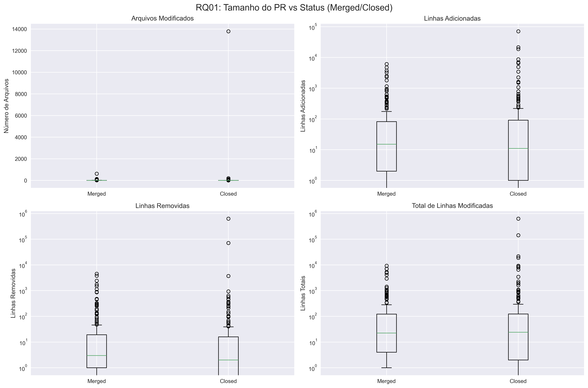
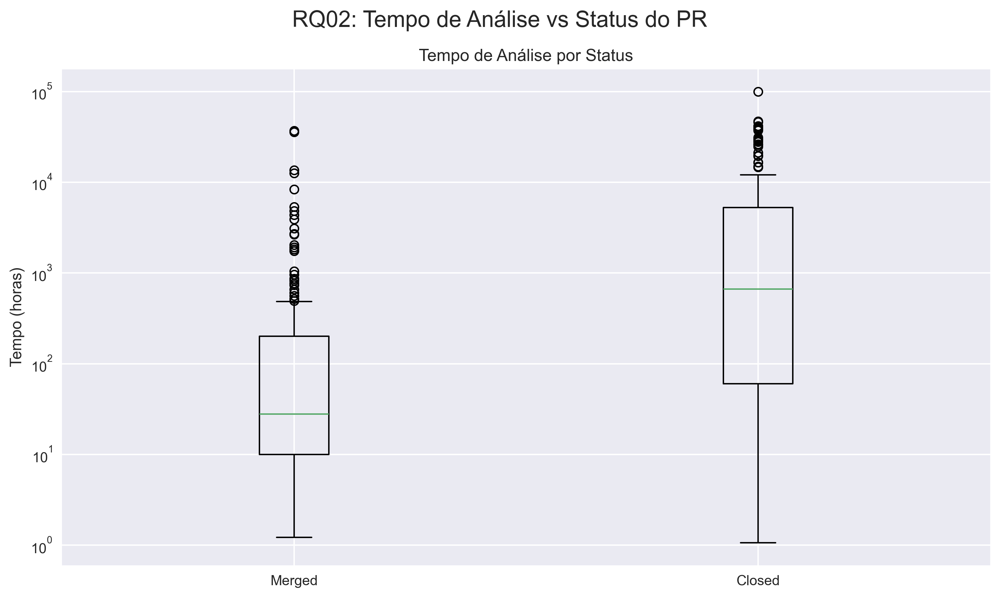
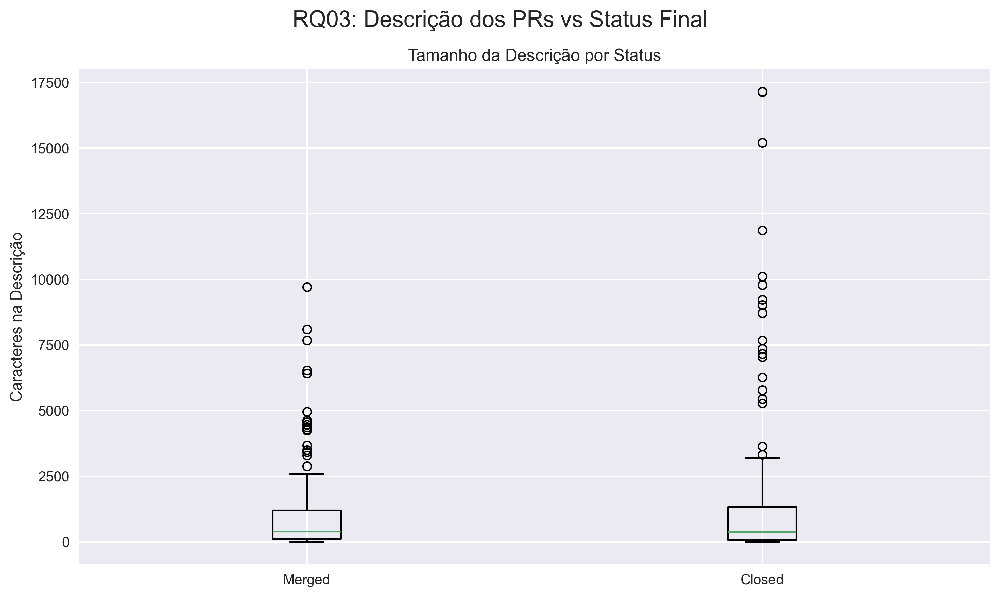
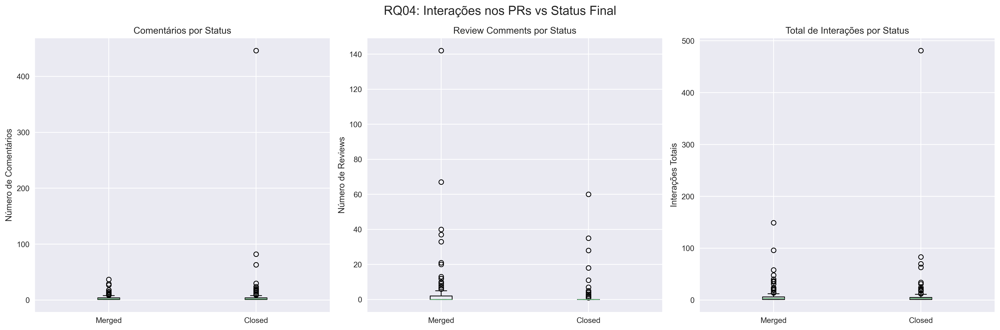
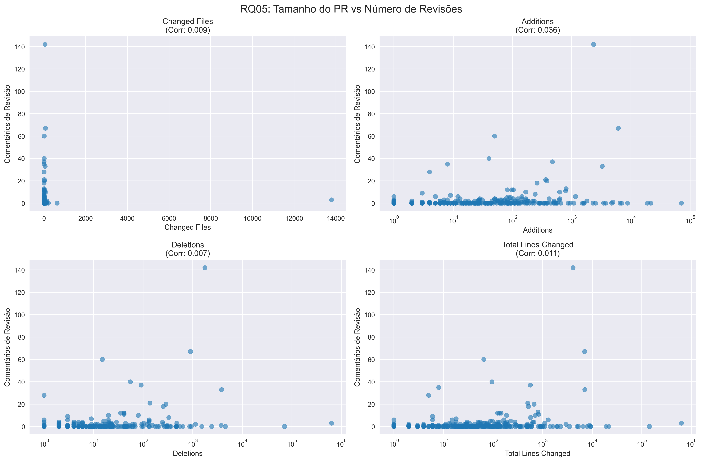
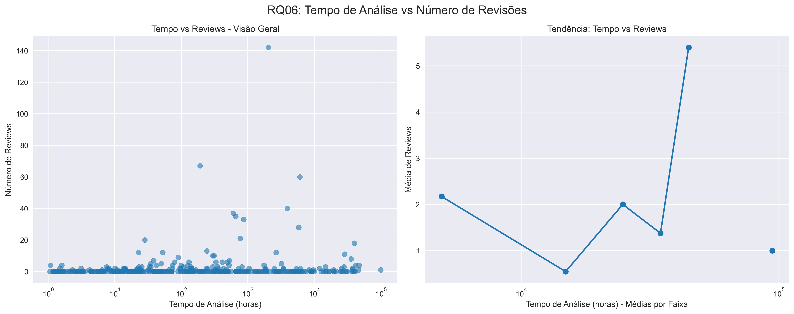
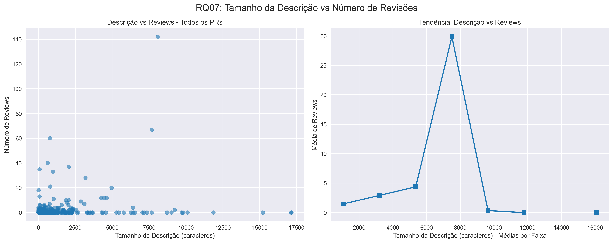
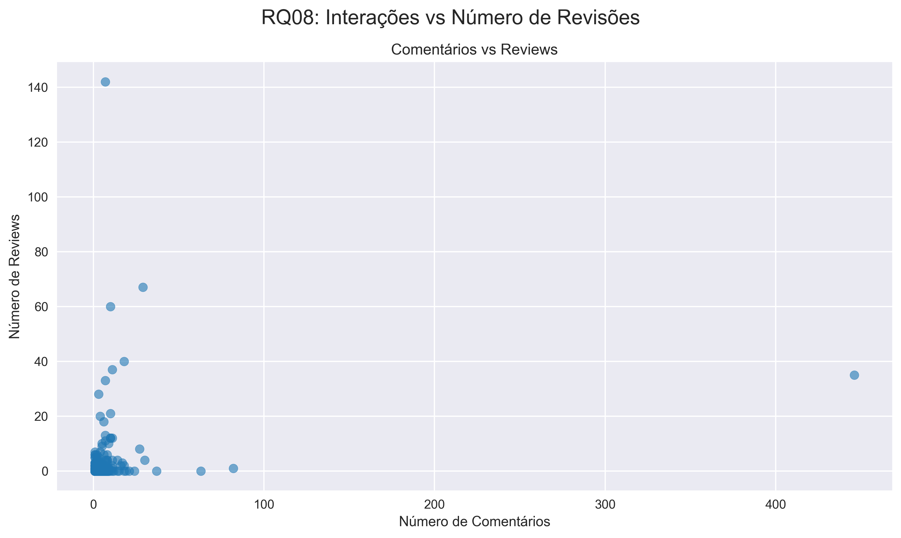
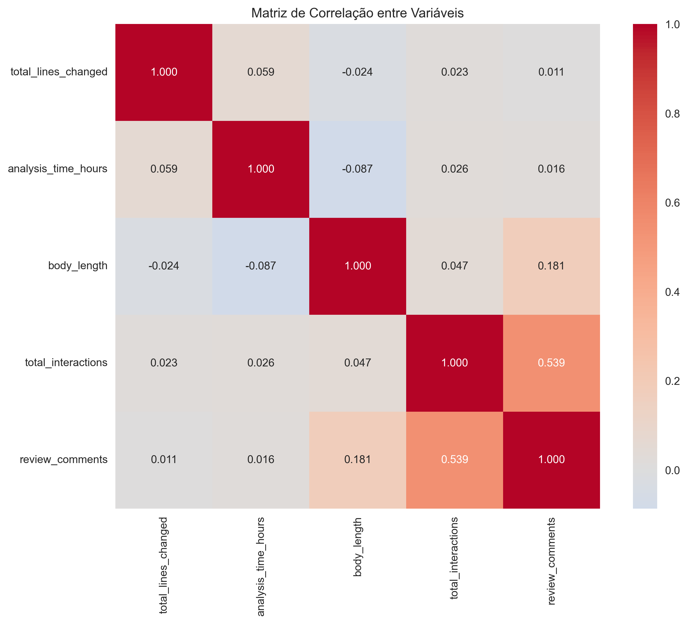

# Relatório Final – Lab03: Caracterizando a atividade de code review no GitHub

## 1. Informações do grupo
- **Disciplina:** Laboratório de Experimentação de Software  
- **Período:** 6º Período  
- **Professor:** Prof. Dr. João Paulo Carneiro Aramuni  
- **Membros do grupo:** Gabriel Faria, Joao Victor Salim, Lucas Garcia, Maisa Pires e Miguel Vieira

---

## 2. Introdução
Este laboratório investiga a atividade de code review em repositórios populares do GitHub, analisando fatores que influenciam no merge de Pull Requests e no número de revisões realizadas.  
Este relatório usa a amostra balanceada de 500 PRs (com 200 repositórios e 2–3 PRs por repositório). Após aplicar filtros e checagens, 381 PRs válidos foram analisados.

### Hipóteses informais
- **IH01:** PRs menores (menos arquivos e linhas modificadas) têm maior probabilidade de serem merged.  
- **IH02:** PRs com descrições mais detalhadas têm maior probabilidade de serem merged.  
- **IH03:** PRs que demoram mais tempo para serem analisados têm menor probabilidade de serem merged.  
- **IH04:** PRs com mais interações (comentários e participantes) têm maior probabilidade de serem merged.  
- **IH05:** PRs maiores requerem mais revisões.

---

## 3. Tecnologias e ferramentas utilizadas
- **Linguagens:** Python  
- **Bibliotecas:** requests, pandas, numpy, matplotlib, seaborn, scipy  
- **API:** GitHub REST API  
- **Análise Estatística:** Teste de correlação de Spearman  

## 4. Metodologia

### 4.1 Coleta de dados
Foram coletados 500 PRs de 200 repositórios populares utilizando a GitHub REST API.
Critério: amostra balanceada por repositório (2–3 PRs), repositórios ordenados por estrelas.

### 4.2 Consolidação
Os dados foram consolidados em data/pull_requests_500.csv com métricas derivadas (tamanho, tempo, interações).
Resultados e figuras foram gerados em results_500pr/, com resumo em results_500pr/analysis_results.json.

### 4.3 Análise
Foi realizada estatística descritiva (medianas) e correlações de Spearman (p < 0,05).
Foram gerados gráficos por RQ e uma matriz de correlação das principais variáveis.

---

## 5. Questões de pesquisa

### RQ01: Qual a relação entre o tamanho dos PRs e o feedback final das revisões?

### RQ02: Qual a relação entre o tempo de análise dos PRs e o feedback final das revisões?  

### RQ03: Qual a relação entre a descrição dos PRs e o feedback final das revisões?

### RQ04: Qual a relação entre as interações nos PRs e o feedback final das revisões?

### RQ05: Qual a relação entre o tamanho dos PRs e o número de revisões realizadas?

### RQ06: Qual a relação entre o tempo de análise dos PRs e o número de revisões realizadas?

### RQ07: Qual a relação entre a descrição dos PRs e o número de revisões realizadas?

### RQ08: Qual a relação entre as interações nos PRs e o número de revisões realizadas?

  

---

## 6. Resultados

### 6.1 Estatísticas descritivas (500 PRs)
- **Total de PRs analisados:** 381
- **PRs merged:** 192 (50,4%)
- **PRs closed:** 189 (49,6%)
- **Mediana de arquivos modificados:** 1
- **Mediana de linhas modificadas:** 23
- **Mediana de tempo de análise:** 125,37 horas
- **Mediana de tamanho da descrição:** 379 caracteres

### 6.2 Gráficos por questão de pesquisa

#### Matriz de Correlação Geral

### 6.3 Principais correlações encontradas

#### RQ01: Tamanho vs Status (500 PRs)
- *Arquivos modificados:* r ≈ 0.130 (p ≈ 0,011) — fraca positiva
- *Total de linhas modificadas:* r ≈ 0,007 (ns) — sem efeito

#### RQ02: Tempo vs Status (500 PRs)  
- *Tempo de análise:* r ≈ -0,409 (p ≪ 0,001) — *negativa forte*
  - PRs merged: mediana ≈ 27,75 h
  - PRs closed: mediana ≈ 663,02 h

#### RQ03: Descrição vs Status (500 PRs)
- *Tamanho da descrição:* r ≈ 0,035 (p ≈ 0,502) — sem correlação significativa
  - PRs merged: mediana 384 caracteres
  - PRs closed: mediana 365 caracteres

#### RQ04: Interações vs Status (500 PRs)
- *Comments:* r ≈ -0,013 (ns)

#### RQ05: Tamanho vs Revisões (500 PRs)
- *Total de linhas modificadas:* r ≈ 0,259 (p ≪ 0,001)
- *Arquivos modificados:* r ≈ 0,219 (p ≪ 0,001)

#### RQ06: Tempo vs Revisões (500 PRs)
- *Tempo de análise:* r ≈ 0,149 (p ≈ 0,0035) — fraca positiva

#### RQ07: Descrição vs Revisões (500 PRs) 
- *Tamanho da descrição:* r ≈ 0,198 (p ≪ 0,001) — fraca positiva

#### RQ08: Interações vs Revisões (500 PRs)
- *Comments vs Reviews:* r ≈ 0,222 (p ≪ 0,001) — fraca positiva

---

## 7. Discussão
A análise (500 PRs) revelou padrões importantes:

### 7.1 Principais achados

*Tempo é crítico para o merge:* correlação negativa forte entre tempo de análise e status (r ≈ -0,409). PRs que ficam muito tempo abertos tendem a fechar sem merge.

*Tamanho influencia revisões:* PRs maiores (mais arquivos/linhas) recebem mais reviews (r ≈ 0,22–0,26), alinhado à IH05.

*Interações:* comments gerais se correlacionam com reviews (r ≈ 0,222), mas não alteraram significativamente o status. Participantes ficou constante e não foi informativo.

### 7.2 Validação das hipóteses

- *IH01 (PRs menores → maior merge):* *NÃO CONFIRMADA* — efeitos pequenos; leve tendência oposta em arquivos modificados.
- *IH02 (Descrições detalhadas → maior merge):* *NÃO CONFIRMADA* — sem efeito significativo em status.
- *IH03 (Tempo longo → menor merge):* *CONFIRMADA* — r ≈ -0,409.
- *IH04 (Mais interações → maior merge):* *PARCIALMENTE CONFIRMADA* — depende do tipo de interação (comments se relacionam a reviews, mas não a status).
- *IH05 (PRs maiores → mais revisões):* *CONFIRMADA* — r ≈ 0,22–0,26.

## 8. Conclusão
Na amostra de 500 PRs (381 válidos), concluímos:

1. O tempo de análise se relaciona fortemente com o resultado (r ≈ -0,409): PRs com longas filas têm menor chance de merge.
2. PRs maiores demandam mais revisões (r ≈ 0,22–0,26), mas tamanho não determinou o status de forma forte.
3. Comentários gerais aumentam a atividade de review (r ≈ 0,222), sem evidência clara de impacto no merge; participantes não foi informativo.
4. Descrições maiores não mostraram ganho significativo de probabilidade de merge.

---

## 9. Referências
- GitHub REST API: https://docs.github.com/en/rest  
- Pandas: https://pandas.pydata.org/  
- Matplotlib: https://matplotlib.org/  
- Seaborn: https://seaborn.pydata.org/  
- SciPy: https://scipy.org/  

---

## 10. Apêndices
- Scripts em scripts/  
- Dataset em data/pull_requests_500.csv
- Resultados detalhados em results_500pr/analysis_results.json
- Visualizações em results_500pr/*.png
