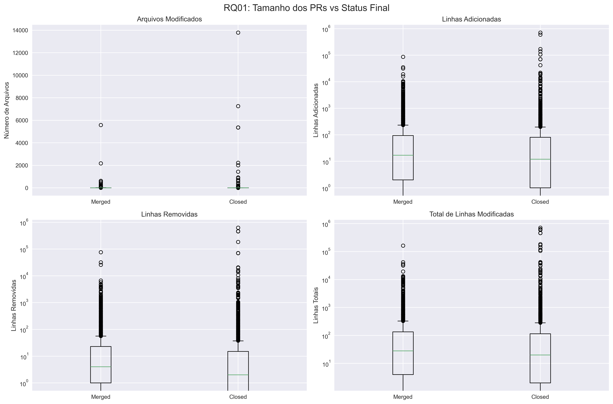
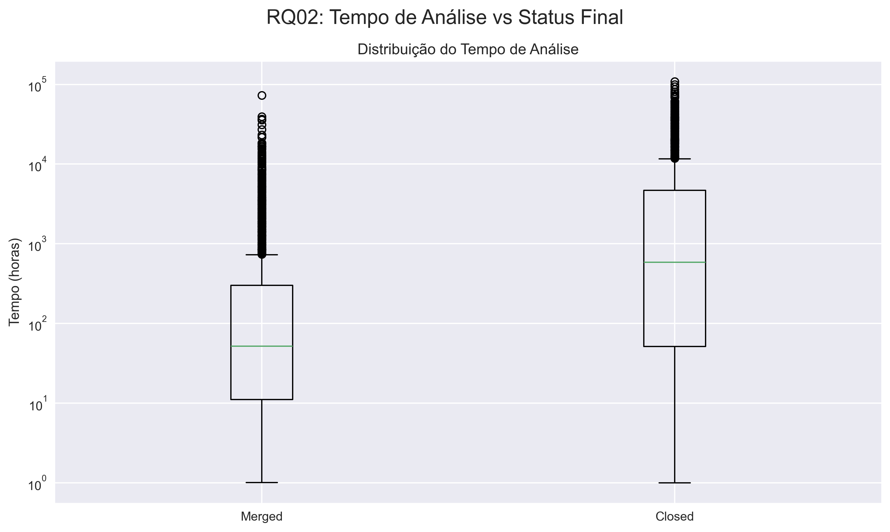
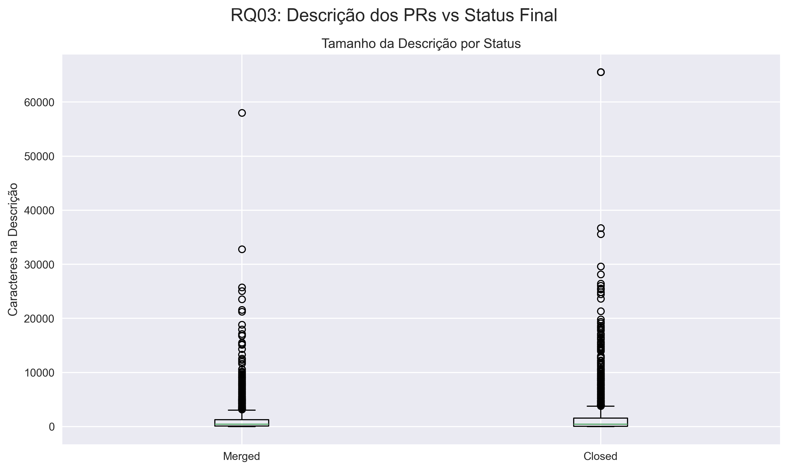
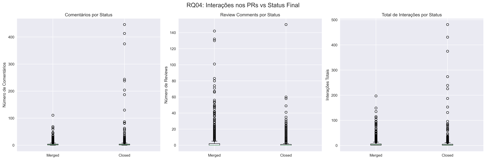
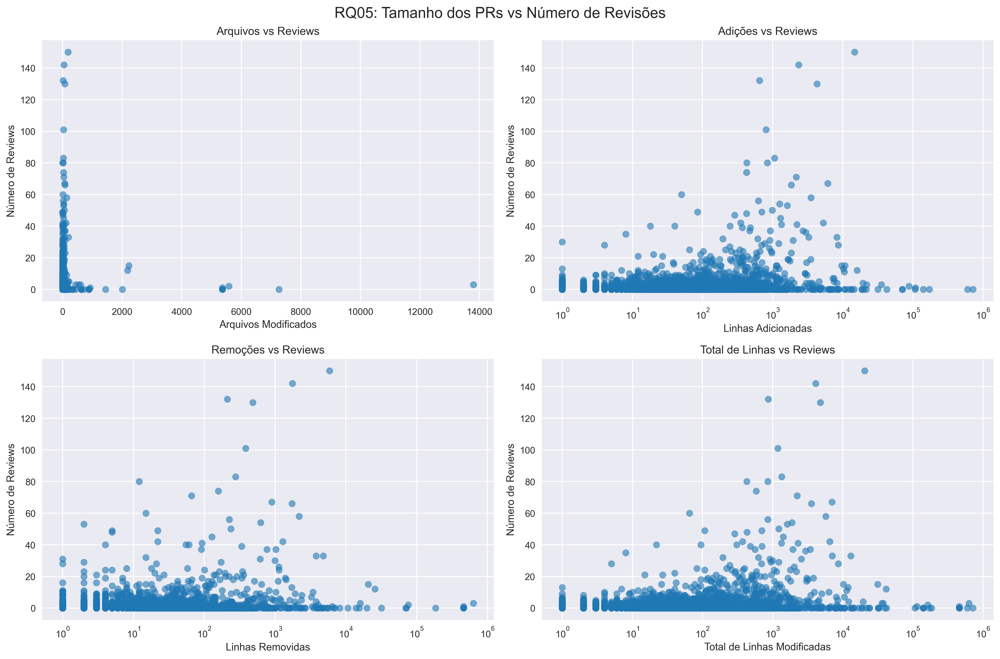
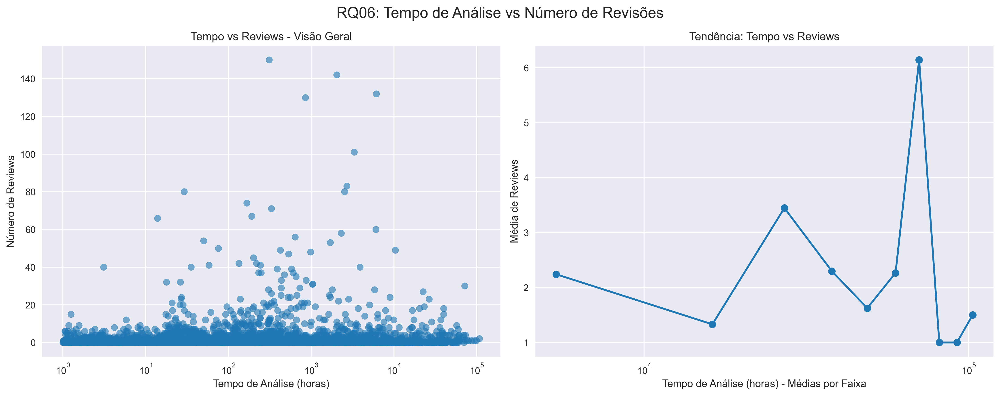
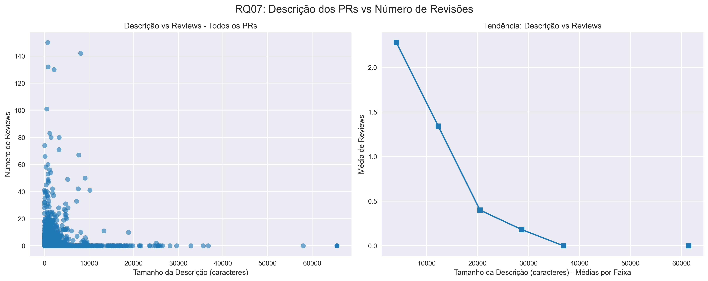
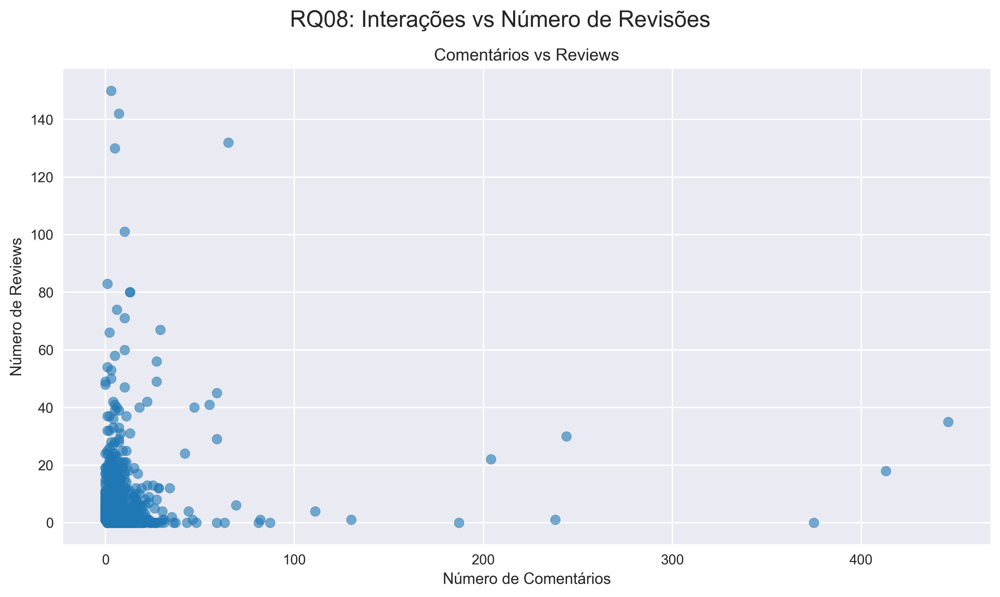
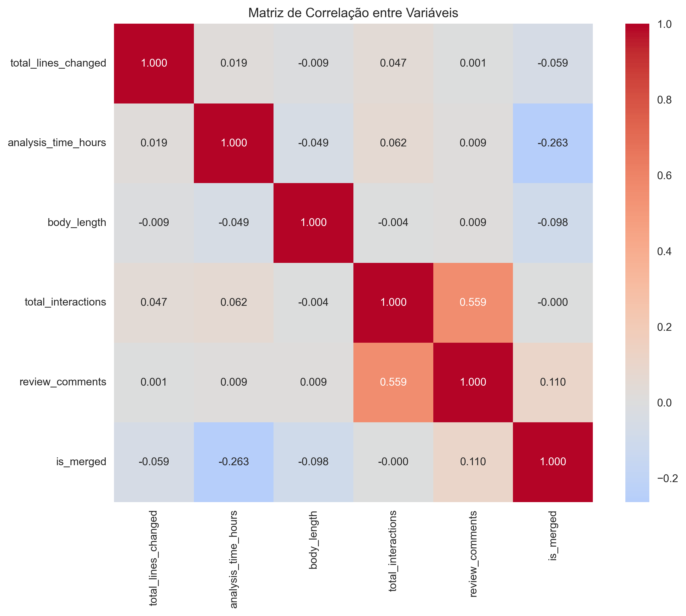

# Relatório Final – Lab03: Caracterizando a atividade de code review no GitHub

## 1. 'Informações do grupo
- **Curso:** Engenharia de Software  
- **Disciplina:** Laboratório de Experimentação de Software  
- **Período:** 6º Período  
- **Professor:** Prof. Dr. João Paulo Carneiro Aramuni  
- **Membros do grupo:** Gabriel Faria, Joao Victor Salim, Lucas Garcia, Maisa Pires e Miguel Vieira

---

## 2. Introdução
Este laboratório investiga a atividade de code review em repositórios populares do GitHub, analisando fatores que influenciam no merge de Pull Requests e no número de revisões realizadas.  
Foram coletados dados de 3.616 PRs válidos dos 200 repositórios mais populares do GitHub, aplicando filtros para garantir que passaram por processo de review humano.

### Hipóteses informais
- **IH01:** PRs menores (menos arquivos e linhas modificadas) têm maior probabilidade de serem merged.  
- **IH02:** PRs com descrições mais detalhadas têm maior probabilidade de serem merged.  
- **IH03:** PRs que demoram mais tempo para serem analisados têm menor probabilidade de serem merged.  
- **IH04:** PRs com mais interações (comentários e participantes) têm maior probabilidade de serem merged.  
- **IH05:** PRs maiores requerem mais revisões.

---

## 3. Tecnologias e ferramentas utilizadas
- **Linguagens:** Python  
- **Bibliotecas:** requests, pandas, numpy, matplotlib, seaborn, scipy  
- **API:** GitHub REST API  
- **Análise Estatística:** Teste de correlação de Spearman  

---

## 4. Metodologia
### 4.1 Coleta de dados
Foram coletados dados dos 200 repositórios mais populares do GitHub (por número de estrelas).  
Para cada repositório, coletamos PRs que atendessem aos critérios:
- Status: MERGED ou CLOSED
- Tempo de análise: ≥ 1 hora (evitar automação)  
- Interações: ≥ 1 comentário ou review

### 4.2 Métricas definidas
**Tamanho:** Número de arquivos modificados, linhas adicionadas e removidas  
**Tempo:** Intervalo entre criação e fechamento/merge do PR  
**Descrição:** Número de caracteres no corpo da descrição  
**Interações:** Número de participantes, comentários e reviews  

### 4.3 Análise estatística
Utilizamos o **teste de correlação de Spearman** por ser adequado para:
- Dados não-paramétricos
- Distribuições assimétricas típicas de repositórios GitHub
- Robustez a outliers

---

## 5. Questões de pesquisa

### RQ01: Qual a relação entre o tamanho dos PRs e o feedback final das revisões?
Esta questão investiga se PRs menores têm maior probabilidade de serem merged. Analisamos número de arquivos modificados, linhas adicionadas e removidas como métricas de tamanho.

### RQ02: Qual a relação entre o tempo de análise dos PRs e o feedback final das revisões?  
Examina se PRs que demoram mais para serem analisados têm menor chance de serem integrados. O tempo é medido desde a criação até o fechamento/merge.

### RQ03: Qual a relação entre a descrição dos PRs e o feedback final das revisões?
Avalia se descrições mais detalhadas (maior número de caracteres) aumentam a probabilidade de merge, facilitando o entendimento pelos revisores.

### RQ04: Qual a relação entre as interações nos PRs e o feedback final das revisões?
Analisa se maior engajamento (comentários, reviews, participantes) está associado a maior taxa de merge dos PRs.

### RQ05: Qual a relação entre o tamanho dos PRs e o número de revisões realizadas?
Investiga se PRs maiores demandam mais rounds de revisão devido à maior complexidade e probabilidade de erros.

### RQ06: Qual a relação entre o tempo de análise dos PRs e o número de revisões realizadas?
Examina se PRs que permanecem abertos por mais tempo acumulam mais revisões ao longo do processo.

### RQ07: Qual a relação entre a descrição dos PRs e o número de revisões realizadas?
Avalia se descrições mais detalhadas resultam em menos revisões por facilitarem o entendimento inicial.

### RQ08: Qual a relação entre as interações nos PRs e o número de revisões realizadas?
Analisa a relação entre comentários e a intensidade do processo de review.

  

---

## 6. Resultados

### 6.1 Estatísticas descritivas
- **Total de PRs analisados:** 3.616
- **PRs merged:** 2.007 (55.5%)
- **PRs closed:** 1.609 (44.5%)
- **Mediana de linhas modificadas:** 24
- **Mediana de tempo de análise:** 139.1 horas
- **Mediana de tamanho da descrição:** 424 caracteres

### 6.2 Gráficos por questão de pesquisa

#### Matriz de Correlação Geral

